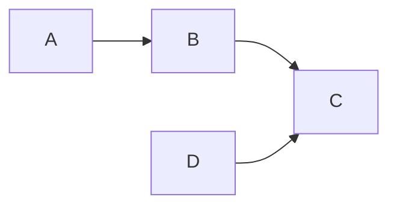

# Purpose
Provide a concise, auditable procedure to merge dependent PRs in waves so merges are safe, traceable, and reversible.

# Scope & Authorization
Apply only to the exact repository, pull request set, and expected-heads explicitly authorized by the user or an accepted bounded plan.

# Definitions
- MERGE_READY: a PR whose head, checks, reviews, and approvals fully satisfy repo policy and whose dependencies are satisfied.
- Wave: a set of independent MERGE_READY PRs merged in the same deployment window.
- Dependency closure: the transitive set of PRs required before a target PR can be considered MERGE_READY.

# Pre-wave checklist
1. Revalidate authorization, actor identity, and exact expected-head OIDs for every node.
2. Confirm required status checks, review approvals, and merge policy eligibility (no stale or skipped checks without proven eligibility).
3. Ensure no unresolved merge conflicts; rebase or resolve as needed.
4. Verify infra and deployment credentials (Kit-managed repos: run `kit aws verify`). Stop on missing or mismatched credentials.
5. Produce evidence artifacts: dependency DAG (Mermaid), a wave table, merge method, and rollback owner.

# Execution algorithm
1. Build a dependency DAG where A --> B means A must be merged (or deployed+accepted) before B.
2. Classify nodes as MERGE_READY, BLOCKED, or UNKNOWN.
3. Select the zero-unmet-dependency MERGE_READY frontier and form a wave. Maximize safe concurrency and prioritize nodes that shorten the critical path.
4. Immediately before the wave, revalidate heads, checks, approvals, policies, and authorization.
5. Merge the wave using the repository-permitted method (merge queue when required). Record the merge claim and relevant evidence.
6. After each successful wave, recompute the DAG. Stop the failed node and its dependents; continue independent MERGE_READY nodes.
7. Repeat until the authorized dependency closure reaches the terminal state.

# Example

Wave table (example):
- Wave 1: A, D
- Wave 2: B
- Wave 3: C

# Evidence & Recording
Record merge, workflow, deployment, runtime acceptance, and rollback ownership as separate claims. Report exact blockers and next safe actions when the closure is not satisfied.

# References
- docs/agents/GUARDRAILS.md
- docs/references/rules/github-pr-merge.md

